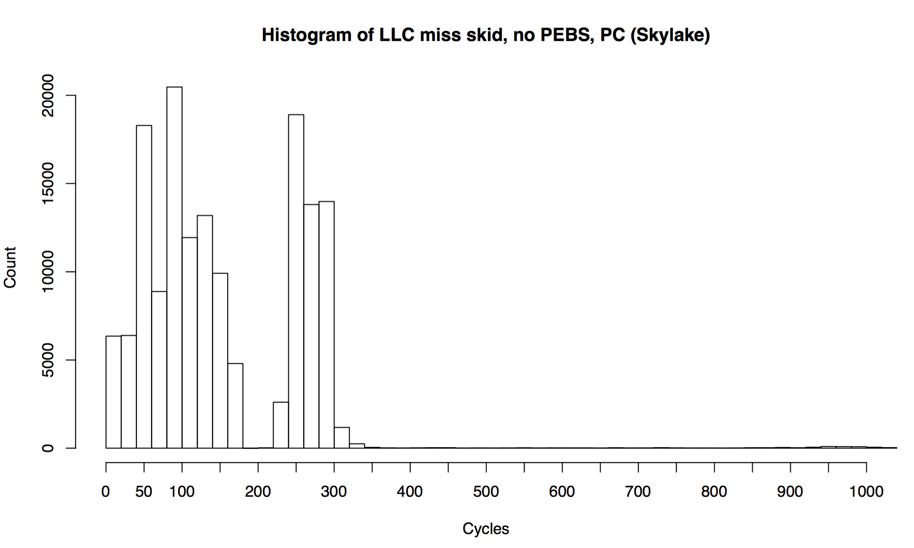

# Processor PMC event skid testing

## Building

```
gcc -O0 -o skidtest skidtest.c  
```

## Recording

For example, every 1000 LLC-miss on Intel using Linux perf:

```
perf record -vv -e r412e -c 1000 ./skidtest 1000000
```

Check the verbose output (-vv) to understand if precise_ip (PEBS) was auto-enabled or not.

Choose a size greater than the LLC cache to induce misses.

## Processing

Various ways to post-process the perf capture. Each of these uses -F to customize the perf script output (older versions, -f), however, on newer kernels the perf script output is sufficient by default (has symoff).

### Hits vs skids

```
perf script --header -F comm,pid,tid,time,event,ip,sym,symoff,dso |\
    awk '/noprunway/ { skid++ } /memreader/ { hit++ } END { printf "hits %d, skid %d\n", hit, skid }'
```

### Skid offset list

```
perf script --header -F comm,pid,tid,time,event,ip,sym,symoff,dso |\
    awk '/noprunway/ { sub(/noprunway\+/, "", $6); print $6 }' | perl -ne 'print hex($_) . "\n"' | sort -n
```

This can also be saved to a file, and used as input for skid.r plotting. Sample:

[](skid.png)

### skid offset histogram (as text)

```
perf script --header -F comm,pid,tid,time,event,ip,sym,symoff,dso |\
    awk '/noprunway/ { sub(/noprunway\+/, "", $6); print $6 }' | perl -e 'while (<>) { $idx = int(hex($_)/10); @a[$idx]++; $m = $idx if $idx > $m; } for ($i = 0; $i < $m; $i++) { $a[$i] += 0; print $i * 10 . " " . $a[$i] . "\n"; }'
```

